# Health Claims Agentic Accelerator v2 (Relational & Supabase-Ready)

This repository provides an end-to-end, multi-agent claims processing accelerator built for the Databricks platform. Version 2.0 introduces a robust relational database design, point-in-time correct feature engineering, and direct integration with an external database (such as Supabase PostgreSQL) for real-world deployment.

---

## Architecture Overview

```mermaid
graph TD
  local_gen[1. Local Synthetic Generator] -- Generates CSVs --> local_csv[(Local CSV Files)]
  local_csv -- Manually Imported --> supabase[(2. Supabase PostgreSQL)]
  
  subgraph Databricks Pipeline
    setup[00_setup.py: UC Schema & Volumes] --> bronze[01_bronze_ingestion.py: Ingestion JDBC/CSV]
    supabase -- Spark JDBC --> bronze
    bronze --> silver[02_silver_preparation.py: Feature Engineering]
    silver --> train[04a/06a: Model Training]
    train --> orchestrate[07_supervisor_orchestrator.py: LangGraph Agents]
    orchestrate --> serving[09_gold_serving.py: Materialize Results]
    serving --> eval[10_evaluation.py: Pipeline Auditing]
  end

  orchestrate -.-> Agent1[Agent 1: Doc Intelligence]
  orchestrate -.-> Agent2[Agent 2: Fraud ML + LLM]
  orchestrate -.-> Agent3[Agent 3: Coverage RAG]
  orchestrate -.-> Agent4[Agent 4: Reserve Estimation]
  orchestrate -.-> Adjuster[Adjuster Allocation Override]
```



### End-to-End Pipeline Steps:
1. **00 Setup & Schemas:** Defines Delta tables with composite keys and masking properties in Unity Catalog.
2. **01 Ingestion (Bronze):** Automatically fetches claims, bills, and policy parameters from **Supabase Postgres** (via JDBC) or local fallback CSV files.
3. **02 Feature Engineering (Silver):** Computes point-in-time correct features (e.g. claim velocities, physician ratios, remaining balances) strictly bounded by the claim's `date_of_loss`.
4. **04a & 06a Model Training:** Trains XGBoost fraud classification and Reserve severity uplift models.
5. **07 Agentic Orchestration:** A LangGraph supervisor coordinates 4 specialized agents sequentially:
   - **Agent 1 (Document Intelligence):** Performs exact name and coverage window cross-validation.
   - **Agent 2 (Fraud Detection):** Blends XGBoost ML predictions with LLM narrative anomaly analysis.
   - **Agent 3 (Coverage Eligibility):** Hybrid pipeline executing deterministic math checks first, falling back to Vector Search RAG for fuzzy exclusion checks.
   - **Agent 4 (Reserve Estimation):** Recommends financial reserves and confidence intervals.
   - **Adjuster Routing Override:** Hard-routes blacklisted provider claims directly to a Senior Field Adjuster.

---

## Deploying with Supabase PostgreSQL (Production Flow)

To configure the accelerator to ingest live data from an external Supabase Postgres DB rather than generating data on the cluster:

### Step 1: Generate & Upload Data Locally
Run the data generator in your local IDE (VS Code or Antigravity terminal):
```bash
python data/generate_synthetic_data.py --num-policies 80 --years 3 --claims-per-year 200
```
This creates the structured CSV files in your local `data/raw/structured/` directory. Manually populate/insert these tables into your Supabase PostgreSQL instance.

### Step 2: Clean up local files (Optional)
Once the data is populated in Supabase, you can safely delete the local CSV files and `data/generate_synthetic_data.py` to keep your deployment repository minimal.

### Step 3: Configure Databricks Asset Bundle (DAB)
Configure the job parameters in your [databricks.yml](file:///d:/Projects/AcceleratorBuilder/health-claims-acceleratorV2/databricks.yml) or inside the Databricks Workspace Job UI:
* Set `use_supabase` to `true`.
* Provide the `supabase_host`, `supabase_port` (default `5432`), and `supabase_db` (default `postgres`) parameters.
* Store your Supabase username and password securely inside Databricks Secrets scope `supabase` (under keys `user` and `password`).

---

## Local Verification & Testing

Verify that agent schemas, temporal parameters, and database rules are working correctly by executing the local test suite:

```bash
# Run the complete test suite locally
python -m pytest
```

### Implemented Test Invariants:
* **[test_point_in_time.py](file:///d:/Projects/AcceleratorBuilder/health-claims-acceleratorV2/tests/test_point_in_time.py):** Asserts that feature engineering does not leak future data.
* **[test_censoring_bias.py](file:///d:/Projects/AcceleratorBuilder/health-claims-acceleratorV2/tests/test_censoring_bias.py):** Verifies that `INVESTIGATION_PENDING` claims are excluded from the physician fraud denominator.
* **[test_floater_balance.py](file:///d:/Projects/AcceleratorBuilder/health-claims-acceleratorV2/tests/test_floater_balance.py):** Asserts that floater policies deplete a shared pool whereas individual policies track separate member balances.
* **[test_deterministic_coverage_math.py](file:///d:/Projects/AcceleratorBuilder/health-claims-acceleratorV2/tests/test_deterministic_coverage_math.py):** Asserts copays, room rent caps, waiting periods, and sub-limits without LLM calls.
* **[test_member_cross_validation.py](file:///d:/Projects/AcceleratorBuilder/health-claims-acceleratorV2/tests/test_member_cross_validation.py):** Asserts exact name-matching and blacklist adjuster routing overrides.
