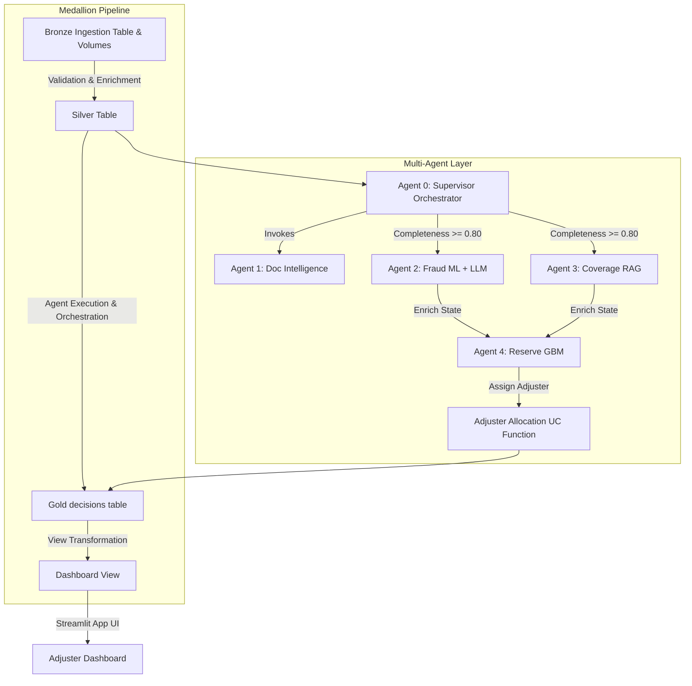
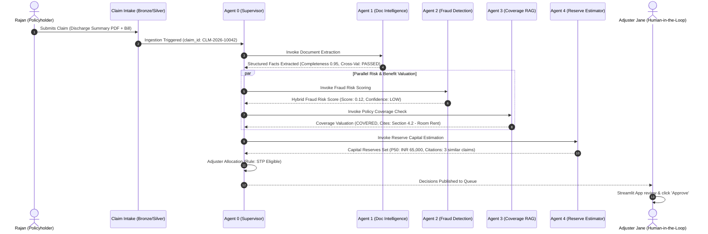

# Premium Accelerator Overview: Multi-Agent Health Claims Accelerator

## 1. Introduction & Value Proposition
The **Multi-Agent Health Claims Accelerator** (engineered by SNS Square) is a state-of-the-art Lakehouse and AI solution built on Databricks. It transforms health insurance claims processing from a slow, manual, rule-based workflow into a highly automated, secure, and intelligent multi-agent orchestration.

By coordinating specialized AI agents via **LangGraph**, the accelerator automates:
1. Document ingestion and medical extraction from discharge summaries.
2. Cross-validation against the carrier's active policy registry.
3. Structured and unstructured fraud anomaly detection (using a hybrid of XGBoost and LLM narrative checking).
4. Coverage eligibility checking (using RAG against policy forms with a hallucination guard).
5. Dynamic reserve estimation with confidence bands (P10/P50/P90).

This results in a **30-40% reduction in claims processing times**, near-instantaneous financial reserve allocations, and a significant decrease in false-positive fraud escalations.

---

## 2. Medallion Ingestion & Processing Architecture

The accelerator leverages the Databricks Medallion Architecture (Bronze → Silver → Gold) to ingest, clean, and enrich claims data.

### 2.1 The Medallion Layers
1. **Bronze Layer**:
   - **Input**: Raw unstructured discharge summaries (stored in Unity Catalog Volumes), policy XMLs, and CSV portal entries.
   - **Process**: Auto Loader ingests structured records into the `bronze_claims` Delta table. Unstructured PDFs and TXT files land directly in UC Volumes.
   - **Output**: Raw append-only Delta tables populated with `ingested_at` and `source` metadata.
2. **Silver Layer**:
   - **Input**: `bronze_claims` table.
   - **Process**: Cleanses, standardizes, and hashes PII (such as claimant names). Computes real-time ML features: `days_since_inception`, `amount_to_premium_ratio`, and `claim_velocity` (prior claims in the last 90 days).
   - **Output**: `silver_claims` (containing validated entries) and `quarantine_claims` (containing failed entries).
3. **Gold Layer**:
   - **Input**: Orchestration output packets.
   - **Process**: Z-Ordered Delta tables optimized for serving. Unpacks the nested JSON claim decision packets using SQL views.
   - **Output**: `gold_claim_decisions` table and `vw_claims_dashboard` serving view.

---

## 3. The Multi-Agent Layer: Internal Technical Spec
At the heart of the accelerator is a coordinated five-agent system built using LangGraph.

### Agent 0: Claim Intake Supervisor (Orchestrator)
- **Role**: Coordinates the downstream specialist agents, manages state, and aggregates outputs into a final `ClaimDecisionPacket` JSON.
- **Tech Stack**: LangGraph + Agent Bricks (Trial) or Sequential State Transition (Free).
- **Execution Flow**:
  1. Receives `claim_id` event trigger.
  2. Executes **Agent 1** (Document Intelligence) to extract facts and compute completeness.
  3. If `completeness_score < 0.80` or cross-validation fails → Halts pipeline and requests missing fields.
  4. If passed → Executes **Agent 2** (Fraud) and **Agent 3** (Coverage Eligibility) in parallel.
  5. Executes **Agent 4** (Reserve Estimation) using results from Agent 2 & 3.
  6. Passes state to **Adjuster Allocation UC Function**.
  7. Writes final aggregated state packet to Gold.

### Agent 1: Document Intelligence Agent
- **Role**: Ingests unstructured medical reports and discharge summaries, extracts critical health fields, and cross-validates them against the policy registry.
- **Input**: TXT / PDF files from `/Volumes/health_claims_dev/claims/raw_documents/`.
- **Output**: Structured JSON containing policy ID, claimant name, dates of admission/discharge, hospital name, `diagnosis_icd`, claimed amount, and attending physician reg number.
- **Cross-Validation**: Queries `policy_master` to verify if the policy number is `ACTIVE` and roughly matches the patient name.

### Agent 2: Fraud Signal Detection Agent
- **Role**: Computes an advisory fraud risk score by blending traditional ML classification and LLM semantic narrative analysis.
- **Input**: Silver ML features + raw discharge narrative text.
- **ML Model**: XGBoost trained on historical claims, utilizing `claim_velocity`, `days_since_inception`, and `amount_to_premium_ratio`.
- **LLM Prompt**: Analyzes the medical narrative for semantic inconsistencies (e.g. upcoding, contradictory discharge remarks).
- **Output**: Blended `fraud_score` (0-1), confidence tier (Low/Medium/High), and risk signals evidence list.

### Agent 3: Coverage Eligibility Agent
- **Role**: Answers if the claim peril, hospital, and timing are covered by the specific policy tier.
- **Input**: Extracted facts + policy form manuals from `/Volumes/health_claims_dev/claims/policy_forms/`.
- **Process**: Performs RAG over the carrier's active policy documentation (indexed in Databricks Vector Search).
- **Hallucination Guard**: A safety layer reading the similarity score from Vector Search. If similarity drops below **0.70**, the guard fires, bypassing LLM generation and returning `NEEDS_REVIEW` with the warning `RAG_CONFIDENCE_LOW`.
- **Output**: `coverage_status` (COVERED / EXCLUDED / PARTIAL / NEEDS_REVIEW) and cited sections.

### Agent 4: Reserve Estimation Agent
- **Role**: Predicts required capital reserves to earmark for the claim based on severity and historical patterns.
- **Input**: Complete extracted claims facts + historical settlement data (`claims_history`).
- **ML Model**: Ensemble of 3 Gradient Boosting Regressors modeling the P10, P50 (median), and P90 quantiles based on `diagnosis_icd`.
- **Output**: Point estimate, confidence intervals, and comparable historical cases list.

---

## 4. Customer Reference Workflow (Outer Side)

To help customers understand how the accelerator functions, let's trace a concrete health claim.

### Concrete Example Scenario
**Customer**: Rajan Subramanian (Policy ID: `POL-HLT-20042`)  
**Medical Event**: Admitted to Apollo Hospital Coimbatore on 2026-05-10 for an Appendectomy (ICD-10 Code: `K35.80`). Discharged on 2026-05-15. Total Bill: `INR 65,000`.

### Step-by-Step Outer Workflow

1. **Intake**: Rajan's doctor uploads the unstructured discharge summary and bill. The system ingests it into Delta Lake.
2. **Extraction & Validation**: Agent 1 reads the discharge report, extracts all 8 mandatory ACORD fields (including physician and ICD codes), and checks if the policy exists and is active. **Rajan's policy is active, name matches, and completeness is 0.95 (PASSED).**
3. **Benefit & Risk Valuation**:
   - **Agent 2 (Fraud)**: Runs Rajan's claim velocity (0 claims in last 90 days) and premium ratio through the XGBoost classifier, combined with an LLM narrative scan. **Result: Fraud Score is 0.12 (LOW risk).**
   - **Agent 3 (Coverage)**: Looks up Rajan's policy manual (Silver tier) via RAG. It matches "Appendectomy" and confirms it is covered. Checks network hospital panel and confirms Apollo Coimbatore is IN-NETWORK. **Result: COVERED.**
4. **Capital Reserves Set**: Agent 4 reviews historical claims for Appendectomies (`K35.80`) and sets capital reserves. **Result: Point reserve at INR 65,000, citation list identifies 3 similar Appendectomy cases.**
5. **Adjuster Allocation**: Adjuster allocation function runs a deterministic check: `fraud < 0.30` and `reserve < 50,000` (within limit) and `covered` → routes to **STP_ELIGIBLE (Straight-Through Processing)**.
6. **Publishing & Review**: The Supervisor assembles the decision packet and writes it to the Gold Delta table. Adjuster Jane reviews it on the Streamlit adjuster dashboard and hits "Approve," creating an immutable audit trail.

---

## 5. Customizability & Extensibility for Clients
The accelerator is designed to be highly modular, allowing insurance carriers to plug in their own rule structures and business logic.

| Component | How to Customize | Files to Modify |
| :--- | :--- | :--- |
| **Operational Thresholds** | Change minimum completeness scores, fraud thresholds, and reserve boundaries. | [thresholds.yml](file:///e:/PraveenFrankly/Databricks/health-claims-accelerator/config/thresholds.yml) |
| **Adjuster Routing** | Modify deterministic rules (e.g. state-specific licensing, medical severity thresholds). | [08_adjuster_allocation.py](file:///e:/PraveenFrankly/Databricks/health-claims-accelerator/notebooks/08_adjuster_allocation.py) |
| **RAG Policy Forms** | Drop new policy contract terms or medical guidelines (TXT, PDF, Word) into UC volume. | `/Volumes/health_claims_dev/claims/policy_forms/` |
| **ML Classifiers** | Retrain XGBoost or Quantile GBM models using own historical claim databases. | [04a_train_fraud_model.py](file:///e:/PraveenFrankly/Databricks/health-claims-accelerator/notebooks/04a_train_fraud_model.py) [06a_train_reserve_model.py](file:///e:/PraveenFrankly/Databricks/health-claims-accelerator/notebooks/06a_train_reserve_model.py) |
| **LLM Endpoint Config** | Swap DBRX for proprietary, fine-tuned models or custom models behind AI Gateway. | [llm_client.py](file:///e:/PraveenFrankly/Databricks/health-claims-accelerator/config/llm_client.py) |

---

## 6. Technical Limitations & Platform Factors (Free vs. Trial/Paid)

When preparing for deployment, carriers should understand platform variances.

### 6.1 Serverless vs. Custom Clusters
- **Free Edition**: Serverless compute only. Large-scale ML model retraining (millions of history rows) is constrained by compute limits.
- **Paid Workspaces**: Full multi-node GPU/CPU clusters with auto-scaling to ZORDER, OPTIMIZE, and retrain seamlessly.

### 6.2 Model Serving Endpoints
- **Free Edition**: Endpoints are limited; running all 5 agents concurrently under separate serving endpoints will trigger account caps.
- **Paid Workspaces**: No active serving cap; deploys fully isolated serverless model endpoints governed by Unity Catalog with scale-to-zero settings.

### 6.3 Vector Search & RAG
- **Free Edition**: Index synchronization is limited. sentence-transformers are run locally as a developer fallback.
- **Paid Workspaces**: Integrates with Databricks Vector Search and Unity AI Gateway for real-time embeddings sync and PII/injection guardrails.
