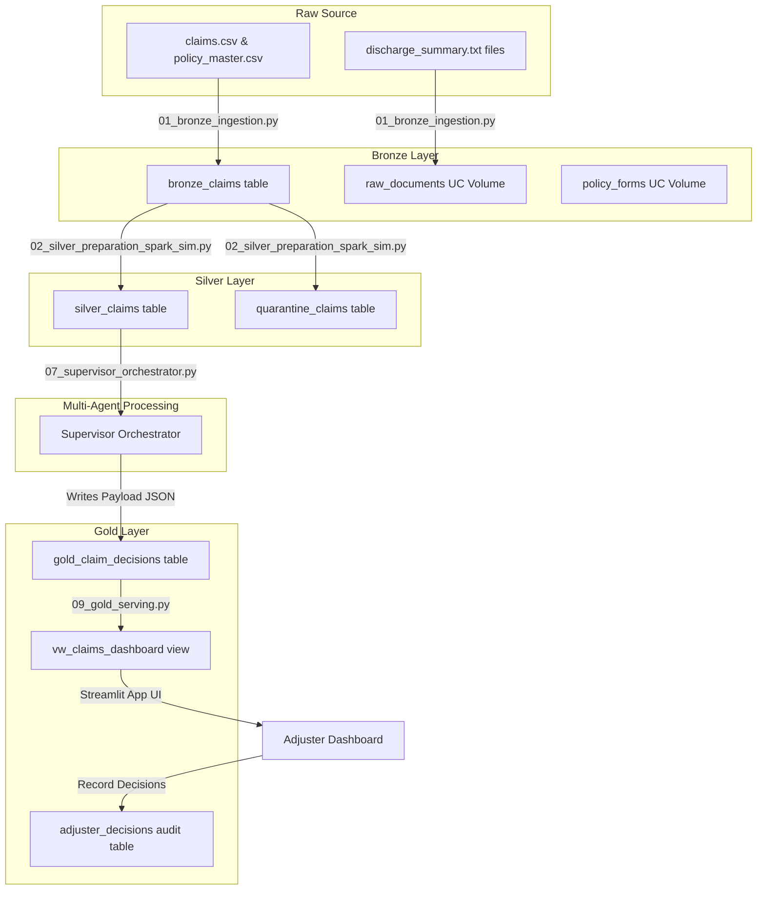
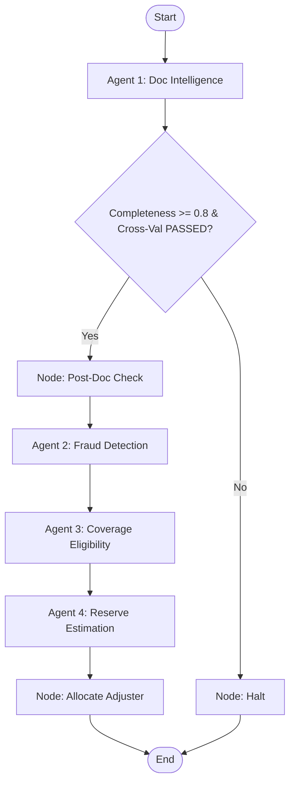
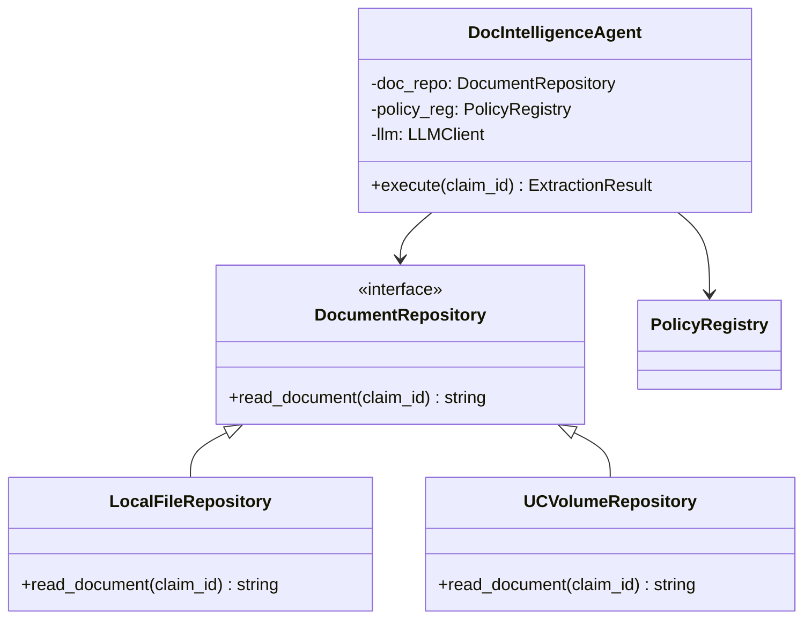

# Codebase Architecture Deep-Dive: Multi-Agent Health Claims Accelerator

This document provides a comprehensive, end-to-end technical analysis of the **Multi-Agent Health Claims Accelerator**. It traces data flows from raw ingestion to final serving, analyzes ML models and vector databases, dissects the orchestration agent layer, and evaluates the codebase structure using canonical codebase-design principles (depth, seams, locality, leverage).

---

## 1. End-to-End Medallion Data Pipeline

The accelerator utilizes a three-tier Medallion architecture to ingestion, process, validate, and serve claims data on the Databricks Lakehouse.



### 1.1 Bronze Ingestion Layer
- **Ingestion Execution**: Managed in [01_bronze_ingestion.py](file:///d:/Projects/AcceleratorBuilder/health-claims-acceleratorV2/notebooks/01_bronze_ingestion.py). It reads structured data from the raw claims CSV and appends it to the Delta table `bronze_claims`. It copies raw unstructured discharge summaries and policy texts into their respective Unity Catalog Volumes.
- **PII Governance**: Enforces security at the schema level.
  - A SQL masking function `phi_masking` is created:
    ```sql
    CREATE OR REPLACE FUNCTION phi_masking(claimant_name STRING)
    RETURN CASE WHEN is_account_group_member('health_claims_auditors') THEN claimant_name ELSE '***MASKED***' END;
    ```
  - Applied directly to the `claimant_name` column of the `bronze_claims` table via `ALTER TABLE ... ALTER COLUMN claimant_name SET MASK ...`.
  - Sensitivity and classification properties are tagged (` sensitivity=PHI `, ` classification=restricted `).

### 1.2 Silver Cleansing & Feature Engineering
- **Production Pipeline**: Described in [02_silver_dlt_real.py](file:///d:/Projects/AcceleratorBuilder/health-claims-acceleratorV2/notebooks/02_silver_dlt_real.py) using Databricks Delta Live Tables (DLT) with streaming syntax.
- **Simulation Pipeline**: Described in [02_silver_preparation_spark_sim.py](file:///d:/Projects/AcceleratorBuilder/health-claims-acceleratorV2/notebooks/02_silver_preparation_spark_sim.py) for local testing or non-DLT workloads.
- **Validation Gates (DLT Expectations)**:
  - `valid_claim_id`: `claim_id IS NOT NULL`
  - `positive_amount`: `claimed_amount > 0`
  - Valid rows that satisfy these expectations are loaded into `silver_claims`.
  - Invalid rows are filtered out and routed to `quarantine_claims` for auditing.
- **PII Hashing**: The `claimant_name` is hashed using SHA-256 (`sha2(col("claimant_name"), 256)`) and saved as `claimant_name_hash`. The raw text column is dropped.
- **ML Feature Computation**:
  1. `days_since_inception`: Computes the duration (in days) between the policy inception date and the date of loss (`datediff(date_of_loss, inception_date)`).
  2. `amount_to_premium_ratio`: Calculates `claimed_amount / premium_paid` (defaults to `0.0` if `premium_paid` is null or zero).
  3. `claim_velocity`: Calculates the number of prior claims filed under the same policy in the last 90 days prior to the current claim's date of loss. Computed by joining the stream with a static view of the historical table `claims_history`.

### 1.3 Gold Serving Layer
- **Gold Transformation**: Implemented in [09_gold_serving.py](file:///d:/Projects/AcceleratorBuilder/health-claims-acceleratorV2/notebooks/09_gold_serving.py).
- **Optimization**: Runs `OPTIMIZE gold_claim_decisions ZORDER BY (claim_id)` to speed up point lookups in Delta Lake.
- **Serving View**: Creates `vw_claims_dashboard`, which uses `get_json_object` to unpack the complex nested JSON payload stored in the `payload` column:
  ```sql
  CREATE OR REPLACE VIEW vw_claims_dashboard AS
  SELECT
      claim_id,
      get_json_object(payload, '$.pipeline_status') as pipeline_status,
      get_json_object(payload, '$.extracted_data.diagnosis_icd') as diagnosis,
      cast(get_json_object(payload, '$.fraud.fraud_score') as double) as fraud_score,
      get_json_object(payload, '$.fraud.confidence') as fraud_confidence,
      get_json_object(payload, '$.coverage.coverage_status') as coverage_status,
      cast(get_json_object(payload, '$.reserve.initial_reserve_amount') as double) as reserve_amount,
      get_json_object(payload, '$.adjuster_allocation') as assigned_adjuster
  FROM gold_claim_decisions
  ```
- **Monitoring**: Declares a stub for Lakehouse Monitoring (`CREATE OR REPLACE MONITOR ... gold_monitor`) scheduled daily to detect data/model drift.

---

## 2. ML Models & Vector Indexing Layer

### 2.1 XGBoost Fraud Classifier
- **Script**: [04a_train_fraud_model.py](file:///d:/Projects/AcceleratorBuilder/health-claims-acceleratorV2/notebooks/04a_train_fraud_model.py).
- **Training Data**: Merges the `silver_claims` feature set with the labels `is_fraud`.
- **Features**: `claimed_amount`, `amount_to_premium_ratio`, `days_since_inception`, `claim_velocity`.
- **Model**: `XGBClassifier` (hyperparameters: `n_estimators=100`, `max_depth=4`, `learning_rate=0.1`).
- **Registration**: Registers the trained model in Unity Catalog as `health_claims_dev.claims.fraud_detection_xgboost` and assigns the `@champion` alias. Saves a fallback pickle to `models/fraud_xgboost.pkl`.

### 2.2 Quantile Reserve Regressor
- **Script**: [06a_train_reserve_model.py](file:///d:/Projects/AcceleratorBuilder/health-claims-acceleratorV2/notebooks/06a_train_reserve_model.py).
- **Target**: `settled_amount` from `claims_history`.
- **Features**: `diagnosis_icd` (one-hot encoded via `ColumnTransformer` + `OneHotEncoder`).
- **Models**: Three separate `GradientBoostingRegressor` instances are trained:
  - **P10 (Low Bound)**: `loss='quantile'`, `alpha=0.1`
  - **P50 (Median Estimate)**: `loss='quantile'`, `alpha=0.5`
  - **P90 (High Bound)**: `loss='quantile'`, `alpha=0.9`
- **Registration**: Registers the P50 model to MLflow/UC as `health_claims_dev.claims.reserve_estimation_gbm`. Pickles all three pipelines as a dictionary into `models/reserve_gbms.pkl` for agent scoring.

### 2.3 Vector Search RAG Configuration
- **Script**: [04b_create_policy_vector_index.py](file:///d:/Projects/AcceleratorBuilder/health-claims-acceleratorV2/notebooks/04b_create_policy_vector_index.py).
- **Data Chunking**: Parses policy forms (e.g. `Silver.txt`, `Gold.txt`, `Premium.txt`), splitting them by regex matching `(Section \d+\.\d+)`. Creates a unique key `chunk_id` (e.g. `Silver_Section_4.2`) and combines section headers and texts.
- **Delta Storage**: Writes chunks to table `policy_chunks` and enables Change Data Feed (`delta.enableChangeDataFeed = true`).
- **Vector Search Endpoint**: Connects to `shared_vs_endpoint` and synchronizes the Delta Sync Index `policy_forms_index` utilizing the model `databricks-bge-large-en`.

---

## 3. Multi-Agent Orchestration Layer (LangGraph)

The orchestration logic lives in [07_supervisor_orchestrator.py](file:///d:/Projects/AcceleratorBuilder/health-claims-acceleratorV2/notebooks/07_supervisor_orchestrator.py) (imported from files under [src/agents/](file:///d:/Projects/AcceleratorBuilder/health-claims-acceleratorV2/src/agents/)).



### 3.1 Graph State Definition
The graph state is defined as a TypedDict:
```python
class ClaimState(TypedDict):
    claim_id: str
    extracted_data: dict
    completeness_score: float
    missing_fields: list
    cross_validation_status: str
    fraud: dict
    coverage: dict
    reserve: dict
    adjuster_allocation: str
    pipeline_status: str
```

### 3.2 Agent Pipeline Execution Nodes

#### Agent 1: Document Intelligence
- **Implementation**: [doc_intelligence.py](file:///d:/Projects/AcceleratorBuilder/health-claims-acceleratorV2/src/agents/doc_intelligence.py).
- **Behavior**: Reads the discharge summary text file from disk, strips control patterns to prevent prompt injections, and sends it to the LLM. The LLM extracts the 8 mandatory ACORD fields in a JSON format.
- **Cross-Validation**: Queries Spark table `policy_master` for the extracted policy number:
  - If the policy doesn't exist $\to$ returns `FAILED_POLICY_NOT_FOUND`.
  - If the policy exists but `status != "ACTIVE"` $\to$ returns `FAILED_POLICY_LAPSED`.
  - If the policy holder's name doesn't match the extracted name $\to$ returns `FAILED_NAME_MISMATCH`.
  - If everything matches $\to$ returns `PASSED` and enriches the state with `plan_tier`, `sum_insured`, and `premium_paid`.

#### Gate Check: `should_continue`
- **Behavior**: Evaluates the state returned by Agent 1. If `completeness_score < 0.80` or `cross_validation_status != "PASSED"`, the pipeline is routed to the `halt` node which sets `pipeline_status = "HALTED_INCOMPLETE"`. Otherwise, it routes to `post_doc_check` and moves onto Agent 2.

#### Agent 2: Fraud Signal Detection
- **Implementation**: [fraud.py](file:///d:/Projects/AcceleratorBuilder/health-claims-acceleratorV2/src/agents/fraud.py).
- **Behavior**: Runs the XGBoost model on features (`claimed_amount`, `amount_to_premium_ratio`, `days_since_inception`, `claim_velocity`) to predict the structured fraud probability (`ml_score`). Simultaneously, it prompts the LLM to scan the text of the discharge summary for clinical red flags (upcoding, unbundling, inflated room rents).
- **Aggregation**: Computes a blended fraud score:
  $$ \text{Fraud Score} = (0.6 \times \text{ml\_score}) + (0.4 \times \text{llm\_fraud\_score}) $$
- **Output**: Returns `fraud_score`, `confidence` tier (LOW/MEDIUM/HIGH), and a list of flagged `fraud_signals`.

#### Agent 3: Coverage Eligibility
- **Implementation**: [coverage.py](file:///d:/Projects/AcceleratorBuilder/health-claims-acceleratorV2/src/agents/coverage.py).
- **Behavior**: Queries the Databricks Vector Search endpoint (or falls back to a local SentenceTransformer + cosine similarity simulation) using the diagnosis and hospital query.
- **Hallucination Guard**: Checks if the maximum similarity score of the retrieved policy chunks is lower than `coverage_similarity_threshold` (configured in [thresholds.yml](file:///d:/Projects/AcceleratorBuilder/health-claims-acceleratorV2/config/thresholds.yml)). If yes, it triggers the guard, skips the LLM check, and sets `coverage_status = "NEEDS_REVIEW"` with exception `RAG_CONFIDENCE_LOW`.
- **LLM Assessment**: If similarity passes, the LLM reads the retrieved policy text and claim facts to output a JSON containing `coverage_status` (COVERED, EXCLUDED, PARTIAL, NEEDS_REVIEW), estimated covered amount, exclusions triggered, and cited policy sections.

#### Agent 4: Reserve Capital Estimation
- **Implementation**: [reserve.py](file:///d:/Projects/AcceleratorBuilder/health-claims-acceleratorV2/src/agents/reserve.py).
- **Behavior**: Sets a baseline reserve equal to the claimed amount (deducting 20% if coverage is `PARTIAL` or setting it to `0` if `EXCLUDED`). Queries the Spark history table `claims_history` for up to 3 similar historical claims using the ICD-10 diagnosis code.
- **LLM Severity Adjustment**: Prompts the LLM to evaluate the clinical severity of the diagnosis and return an uplift multiplier (between 1.0 and 1.5).
- **Confidence Bands**: Estimates the reserve interval limits:
  - **P50**: $\text{base\_reserve} \times \text{uplift}$
  - **P10**: $\text{base\_reserve} \times 0.8 \times \text{uplift}$
  - **P90**: $\text{base\_reserve} \times 1.2 \times \text{uplift}$

#### Route: Adjuster Allocation Routing
- **Implementation**: [adjuster_allocation.py](file:///d:/Projects/AcceleratorBuilder/health-claims-acceleratorV2/src/agents/adjuster_allocation.py).
- **Behavior**: Evaluates routing thresholds configured in `config/thresholds.yml`:
  ```python
  if fraud_score > fraud_high or reserve_amount > reserve_high:
      adjuster = "SENIOR_FIELD_ADJUSTER"
  elif coverage_status == "NEEDS_REVIEW":
      adjuster = "MEDICAL_EXAMINER"
  elif fraud_score < fraud_stp and reserve_amount < reserve_stp and coverage_status == "COVERED":
      adjuster = "STP_ELIGIBLE" # Straight-Through Processing
  else:
      adjuster = "STAFF_ADJUSTER"
  ```

---

## 4. Human-in-the-Loop Streamlit UI Dashboard

The UI dashboard is implemented in [app.py](file:///d:/Projects/AcceleratorBuilder/health-claims-acceleratorV2/app/app.py) and contains 4 distinct tabs:

1. **Live Simulator**:
   - Allows users to select a pending claim from `silver_claims`.
   - Renders the raw text of the discharge summary.
   - Triggers the execution of the LangGraph Supervisor orchestrator end-to-end. Shows log progress and output JSON payloads for each agent.
   - Saves the final adjudication packet back to `gold_claim_decisions` using a SQL `MERGE` statement.
2. **Adjuster Review**:
   - Queries `vw_claims_dashboard` to render the adjuster's queue.
   - Let's adjusters action a claim (Approve, Deny, or Request Investigation).
   - Records human actions in the audit table `adjuster_decisions`.
3. **Gold Explorer**:
   - Let's users browse raw claims and view the full nested JSON payloads of completed decision packets.
4. **Analytics**:
   - Renders high-level KPIs including: Total Processed Claims, Average AI Processing Time, Auto-Adjudication Rate, and Total Initial Reserve.

---

## 5. Architectural & Codebase Design Analysis

Analyzing the codebase through the principles of the `/codebase-design` skill reveals several areas of architectural friction, shallow interfaces, and seam leakage.

### 5.1 Analysis of Depth, Seams, and Locality

| Module | Interface Size | Implementation Complexity | Depth / Leverage | Assessment |
| :--- | :--- | :--- | :--- | :--- |
| **Orchestrator** ([07_supervisor_orchestrator.py](file:///d:/Projects/AcceleratorBuilder/health-claims-acceleratorV2/notebooks/07_supervisor_orchestrator.py)) | **Medium**: Accepts `ClaimState` and outputs updated state. | **High**: Manages LangGraph compile, conditional edge definitions, and fallback executions. | **High Depth**: Callers simply pass an ID; the orchestrator coordinates 5 modules. | Good seam, but leaks Spark context dependencies down to nodes. |
| **Doc Intelligence** ([doc_intelligence.py](file:///d:/Projects/AcceleratorBuilder/health-claims-acceleratorV2/src/agents/doc_intelligence.py)) | **High**: Expects a dictionary, implicitly depends on file paths and a global Spark context. | **Medium**: Parses text using LLM prompts and filters tables. | **Shallow**: Callers have to mock the filesystem and active Spark tables to test. | Leaks filesystem and Spark schemas across its seam. |
| **Fraud Agent** ([fraud.py](file:///d:/Projects/AcceleratorBuilder/health-claims-acceleratorV2/src/agents/fraud.py)) | **High**: Expects `ClaimState` dictionary containing feature values or falls back to defaults. | **Medium**: Combines XGBoost model predictions and LLM calls. | **Shallow**: Hardcodes model paths and depends on MLflow registry. | Poor locality: ML model loading errors occur inside agent execution. |
| **Coverage Agent** ([coverage.py](file:///d:/Projects/AcceleratorBuilder/health-claims-acceleratorV2/src/agents/coverage.py)) | **High**: Implicitly queries vector databases or imports SentenceTransformer. | **High**: Reads text files, splits sections, computes embeddings. | **Shallow**: Directly imports heavy libraries inside the function body. | Poor locality: Fallback calculations and vector database connections are bundled inside the agent. |
| **Reserve Agent** ([reserve.py](file:///d:/Projects/AcceleratorBuilder/health-claims-acceleratorV2/src/agents/reserve.py)) | **High**: Expects dictionary, queries Spark tables within the function block. | **Medium**: Calculates baseline reserve and queries LLM. | **Shallow**: Queries Spark table directly, making test mock setups difficult. | Leaks database connections. |

### 5.2 Key Architectural Friction Points

1. **Lack of Dependency Injection (Seam Leakage)**:
   - Every agent accesses files, databases, and ML models directly within its main function body. For instance, [doc_intelligence.py](file:///d:/Projects/AcceleratorBuilder/health-claims-acceleratorV2/src/agents/doc_intelligence.py) opens a file path using a hardcoded local relative path and instantiates a Spark session inside the function.
   - This makes testing hard: a developer cannot run a simple unit test for the LLM extraction logic without mocking the global Spark catalog or creating temporary directories on disk.
2. **Shallow Module Interfaces**:
   - The interface of every agent is `def agent_name(claim_state: dict) -> dict`. This is extremely shallow. Because the parameters are packed into an untyped dictionary, callers have no visibility into what fields are required, what keys are added, or what types are returned.
   - For example, [fraud.py](file:///d:/Projects/AcceleratorBuilder/health-claims-acceleratorV2/src/agents/fraud.py) expects `claim_state` to contain `extracted_data.premium_paid`, `amount_to_premium_ratio`, `days_since_inception`, and `claim_velocity`. If these keys are missing or misspelled, it falls back to silent defaults without warning the orchestrator.
3. **High Code Redundancy**:
   - The orchestrator logic is duplicated: the core agent implementations are under `src/agents/` but the Databricks notebooks (e.g. [03_agent1_doc_intelligence.py](file:///d:/Projects/AcceleratorBuilder/health-claims-acceleratorV2/notebooks/03_agent1_doc_intelligence.py)) copy large chunks of the identical python functions.
   - If an engineer refactors the prompt in `src/agents/doc_intelligence.py`, they must manually sync the change to `notebooks/03_agent1_doc_intelligence.py`, violating DRY (Don't Repeat Yourself) and causing maintenance friction.
4. **Poor Test Locality**:
   - The test directory contains only a single empty file [test_placeholder.py](file:///d:/Projects/AcceleratorBuilder/health-claims-acceleratorV2/tests/test_placeholder.py). Testing is instead conducted in production notebooks (e.g., [10_evaluation.py](file:///d:/Projects/AcceleratorBuilder/health-claims-acceleratorV2/notebooks/10_evaluation.py)) which load notebooks dynamically using `runpy.run_path`.
   - This makes TDD (Test-Driven Development) impossible as there are no rapid local unit tests running on code changes.

---

## 6. Recommended Redesign & Refactoring Plan

To address these architectural issues, we can refactor the codebase to introduce deep modules, clear seams, and high locality.

### Step 1: Standardize Domain Models with Pydantic
We should introduce structured schemas to replace the raw python dictionaries passed between agent nodes. This clarifies the module interfaces:
- **`ClaimContext`**: Policy details, claimed amount, ICD code, etc.
- **`ExtractionResult`**: Extracted ACORD fields.
- **`AdjudicationState`**: The complete state passing through the LangGraph.

### Step 2: Implement Dependency Injection
Move all external integrations (filesystems, databases, vector search clients, ML models, LLMs) behind abstract adapter interfaces:
- **`DocumentRepository`**: Abstract class with method `read_document(claim_id: str)`.
- **`PolicyRegistry`**: Abstract class with method `get_policy(policy_number: str)`.
- **`VectorSearchClient`**: Abstract class with method `search_policy_chunks(query: str)`.
- **`Predictor`**: Abstract class for loading ML models and returning probability scores.



By passing these adapters into the agent constructors, we can:
1. Write pure local unit tests passing mock/in-memory adapters without Spark, MLflow, or active API keys.
2. Swap local adapters for Unity Catalog volume adapters without changing the core agent code.

### Step 3: Eliminate Notebook Duplication
Refactor the Databricks notebooks to act as **lightweight entrypoints (wrappers)** that simply import the core logic from `src/agents/` and pass the Databricks Spark session as a dependency. The notebooks should contain no duplicate agent code.
For example, [03_agent1_doc_intelligence.py](file:///d:/Projects/AcceleratorBuilder/health-claims-acceleratorV2/notebooks/03_agent1_doc_intelligence.py) should be reduced to:
```python
from src.agents.doc_intelligence import agent1_doc_intelligence
claim_state = {"claim_id": dbutils.widgets.get("claim_id")}
result = agent1_doc_intelligence(claim_state, spark=spark)
dbutils.notebook.exit(json.dumps(result))
```

### Step 4: Establish Local Unit Tests (TDD-Friendly)
Create a full suite of unit tests in the `/tests` folder utilizing `pytest`. Introduce test fixtures for mocked documents and policy records. This enables quick testing of the hallucination guard thresholds, fraud aggregation weights, and adjuster allocation routing rules in seconds.
